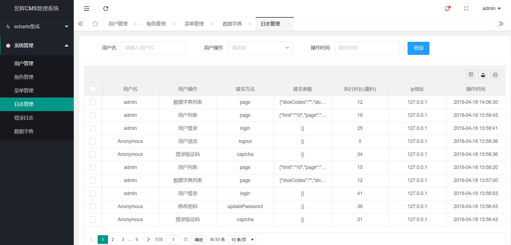

# Ahsj-Project-Web   一个企业级别，用了30多个项目的脚手架项目

## 项目介绍

Ahsj基于SpringBoot、Spring-Security、Mybatis-Plus、Druid、Freemarker、Layui等开发的轻量级管理系统快速开发脚手架。拥有用户、角色、菜单、日志、登录日志、数据字典管理、代码生成器、权限数据同步更新等功能，并此项目会进行持续更新升级，欢迎使用。

作者第一次发布完整开源项目,可能会有很多需要修改的地方,欢迎提交意见

项目架构作者：

陈天狼 英文名：Eastern unbeaten  

邓阳波 外号名：波波

## 项目启动后访问呢地址
`http://127.0.0.1:8080/nebula-web/sign/login.html`, 账号: admin/123456@!Ab

## WEB版本已经实现功能
- 实现基本的用户登录、用户注销、修改密码等基本功能 RAS非对称加密。

- 实现用户增加、用户修改、用户删除、高级查询、导入、导出等基本功能。  

- 实现角色增加、角色修改、角色删除等基本功能。

- 实现菜单增加、菜单修改、菜单删除、按钮权限、等基本功能。

- 实现机构增加、机构修改、机构删除等基本功能。

- 实现系统日志和登录日志的功能。  

- 实现数据字典增加、数据字典修改、数据字典删除等基本功能。

- 实现了在线日志功能、直接可以看到后端在线日志(有点消耗性能)。

- 实现了代码生成器、对Mybatis-Plus的生成器做了兼容

  ## API版本已经实现功能

- 实现了Token拦截器

- 实现了Token注入当前登录用户

- 实现了Jdk8时间格式化

-  实现了redis集成,json序列化

### 技术选型

#### 后端技术:
技术 | 名称 | 官网
----|------|----
Spring Framework | 容器  | [http://projects.spring.io/spring-framework/](http://projects.spring.io/spring-framework/)
SpringBoot | 容器  | [https://spring.io/projects/spring-boot](https://spring.io/projects/spring-boot)
Spring-Data-Redis | 缓存 | [https://spring.io/projects/spring-data-redis](https://spring.io/projects/spring-data-redis)
SpringMVC | MVC框架  | [http://docs.spring.io/spring/docs/current/spring-framework-reference/htmlsingle/#mvc](http://docs.spring.io/spring/docs/current/spring-framework-reference/htmlsingle/#mvc)
Spring Security | 安全框架  | [https://spring.io/projects/spring-security](https://spring.io/projects/spring-security)
Spring session | 分布式Session管理  | [http://projects.spring.io/spring-session/](http://projects.spring.io/spring-session/)
MyBatis-Plus | ORM框架  | [https://mp.baomidou.com/](https://mp.baomidou.com/) 
MyBatis-Plus-Generator | 代码生成  | [https://mp.baomidou.com/guide/generator.html](https://mp.baomidou.com/guide/generator.html) 
Druid | 数据库连接池  | [https://github.com/alibaba/druid](https://github.com/alibaba/druid)
FreeMarker | 模板引擎  | [http://freemarker.foofun.cn/](http://freemarker.foofun.cn/)
Redis | 分布式缓存数据库  | [https://redis.io/](https://redis.io/)
Log4J | 日志组件  | [https://logging.apache.org/log4j/2.x/](https://logging.apache.org/log4j/2.x/)
Protobuf & json | 数据序列化  | [https://github.com/google/protobuf](https://github.com/google/protobuf)
Maven | 项目构建管理  | [http://maven.apache.org/](http://maven.apache.org/)
Netty-socketio | 实时推送  | [https://github.com/mrniko/netty-socketio](https://github.com/mrniko/netty-socketio)

#### 前端技术:
技术 | 名称 | 官网
----|------|----
jQuery | 函式库  | [http://jquery.com/](http://jquery.com/)
layui | UI框架  | [https://www.layui.com/](https://www.layui.com/)
Font-awesome | 字体图标  | [http://fontawesome.io/](http://fontawesome.io/)
material-design-iconic-font | 字体图标  | [https://github.com/zavoloklom/material-design-iconic-font](https://github.com/zavoloklom/material-design-iconic-font)
zTree | 树插件  | [http://www.treejs.cn/v3/](http://www.treejs.cn/v3/)
Select2 | 选择框插件  | [https://github.com/select2/select2](https://github.com/select2/select2)
zheng.jtotop.js | 返回顶部插件  | [https://github.com/shuzheng/zheng.jtotop.js](https://github.com/shuzheng/zheng.jtotop.js)
socket.io.js | SocketIO插件  | [https://socket.io/](https://socket.io/)

### 项目包结构


## 部分界面展示
### 登录页面

### 系统首页
`访问量图表显示不正常,需集成百度统计。同时二次开发根据业务修改,此处只是一个静态页面`

### 用户管理


### 角色管理

### 菜单管理

### 日志管理

### 登录日志

### 数据字典


# 项目导入后使用方法
### 软件需求-必须 

下面几个不知道的自行百度

````
JDK1.8+
MySQL5.6+
Maven3.6+
redis3.0+
````
### 项目导入-idea问题

##### 1、百度搜索 idea maven 项目导入

##### 2、百度搜索 Maven 配置

### 使用步骤

##### 1.使用前提：安装lombok插件

- IDEA安装方法：[https://blog.csdn.net/zhglance/article/details/54931430](https://blog.csdn.net/zhglance/article/details/54931430)
- eclipse安装方法：[https://blog.csdn.net/dorothy1224/article/details/79280591/](https://blog.csdn.net/dorothy1224/article/details/79280591/)

##### 2.导入SQL，下面二选一就行

1.将项目根目录下的docs/sql/nebula-web.sql导入至数据库
2.直接导入docs/sql/20220616001828.nb3数据库备份文件也行

##### 3.修改项目配置指向 

配置文件说明，根据环境修改,注意application.yml的spring.profiles.active的值为配置环境的值


根据环境修改,注意application.yml的spring.profiles.active为dev环境


##### 4.修改数据库信息  

数据库信息分别是

```
datasource:
  mysql:
    validation-query: select 1
    driver: com.mysql.jdbc.Driver
    database: 数据库名字
    ip: 数据库地址
    port: 数据库端口号
    username: 数据库账号
    password: 数据库密码
    url: jdbc:mysql://${datasource.mysql.ip}:${datasource.mysql.port}/${datasource.mysql.database}?useSSL=false&serverTimezone=UTC&characterEncoding=utf8
  oracle:
    validation-query: select 1 from dual
    driver: oracle.jdbc.OracleDriver
    sid: NCP
    ip: 数据库地址
    port: 数据库端口号
    username: 数据库账号
    password: 数据库密码
    url: jdbc:oracle:thin:@(DESCRIPTION = (ADDRESS = (PROTOCOL = TCP)(HOST =${datasource.oracle.ip} )(PORT = ${datasource.oracle.port} )) (ADDRESS = (PROTOCOL = TCP)(HOST = ${datasource.oracle.ip} )(PORT = ${datasource.oracle.port})) (LOAD_BALANCE = yes) (CONNECT_DATA = (SID  = ${datasource.oracle.sid})))
  redis:
    database: 数据库索引
    ip: 数据库地址
    port: 数据库端口
    password: 数据库密码，没有就空
  druid:
    login-username: admin
    login-password: 123456
```


##### 5.启动


运行`WebApplication.java`, 默认端口为8080。

http://127.0.0.1:8888/nebula-web/sign/login.html

账号: admin/123456@!Ab

### 实用接口
- 获取当前登录的用户  
````
SysUser sysUser = (SysUser) request.getSession().getAttribute(LoginForm.LOGIN_USER_KEY);
````
- 权限标签按钮级别控制
````
1.页面引入: <#assign sec=JspTaglibs["http://http://www.ahsj.link/security/tags"]/>
2.标签使用: 
    <@sec.authenticate grants="user:userList">
        <button class="layui-btn layui-btn-normal" id="userSearchBtn" data-type="reload">查询</button>
    </@sec.authenticate>
````

# 使用扩展
### 自定义密码算法
默认加密方式为md5,你可以自定义密码的加密规则.
````
@Configuration
public class PasswordConfigurer{
    
    @Bean
    public PasswordEncryptor passwordEncryptor(){
        return new PasswordEncryptor() {
            @Override
            public String encrypt(String password) {
               //实现自定义的密码的加密规则
               return null;
            }

            @Override
            public String decrypt(String encryptedPassword) {
               //如果自定义的密码的加密规则为可解密,则需实现该解密方法
               return null;
            }
        };
    }
}
````
### 自定义图形验证码文本内容
- 默认图形验证码文本为数学表达式,你可以自定义图形验证码文本.
````
import com.google.code.kaptcha.Producer;

@Configuration
public class VerifyCodeGeneratorConfigurer{

    @Autowired
    private Producer producer;
    
    @Bean
    public VerifyCodeGenerator verifyCodeGenerator(){
        return (String key, HttpSession session) -> {
            //自定义验证码内容
            String text = producer.createText();
            session.setAttribute(key, text);
            return text;
        };
    }
}
````
### 部署到服务器(jar方式)

前置条件，必须把 ahsj 的核心包放仓库


- 1.执行打包命令
````
mvn package -Dmaven.test.skip=true
````
- 2.拷贝target目录下的nebula-web.jar到服务器,然后启动。看到以下输出信息,打开浏览器访问`http://192.168.1.162:18080`,看到登录页面,表示部署成功
````
[root@csy201805 nebula-web]# nohup java -jar nebula-web.jar > log/server.log 2>&1 &
  .   ____          _            __ _ _
 /\\ / ___'_ __ _ _(_)_ __  __ _ \ \ \ \
( ( )\___ | '_ | '_| | '_ \/ _` | \ \ \ \
 \\/  ___)| |_)| | | | | || (_| |  ) ) ) )
  '  |____| .__|_| |_|_| |_\__, | / / / /
 =========|_|==============|___/=/_/_/_/
 :: Spring Boot ::        (v2.1.3.RELEASE)
 
......
2019-04-19 15:42:59.386  INFO 1724 --- [           main] o.s.b.w.embedded.tomcat.TomcatWebServer  : Tomcat started on port(s): 18080 (http) with context path '/nubula-web'
2019-04-19 15:42:59.397  INFO 1724 --- [           main] WebApplication            : Started WebApplication in 9.863 seconds (JVM running for 11.096)
````
- 注意事项  
1.有可能报log/server.log目录或文件不存在,这是因为首次启动,只需创建对应的文件和文件夹,然后再启动即可。  
2.本例子部署的服务为192.168.1.162,应用启动端口为18080,实际按部署环境进行访问地址即可。

